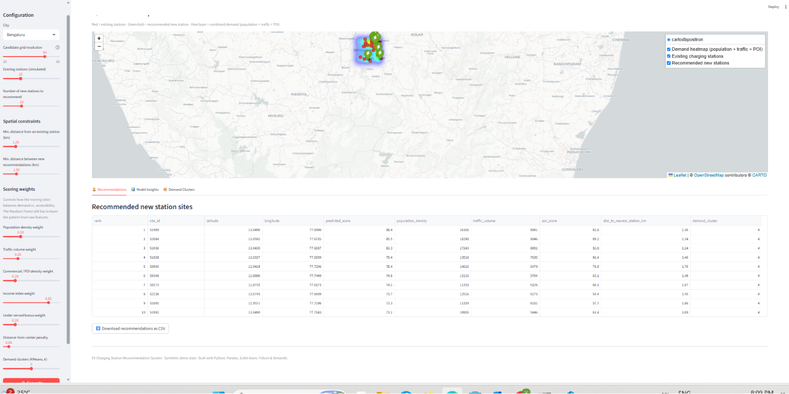
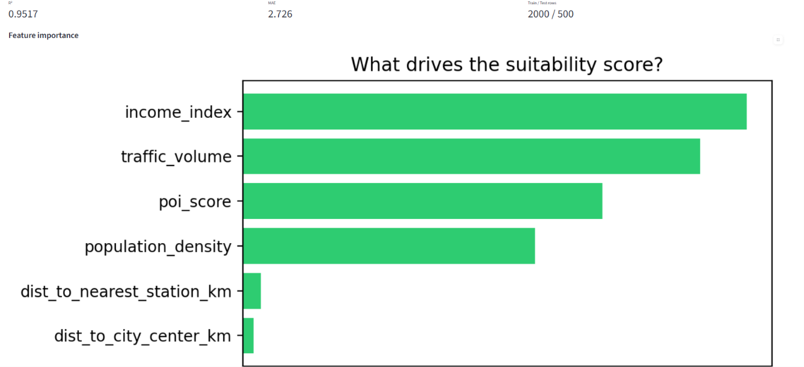
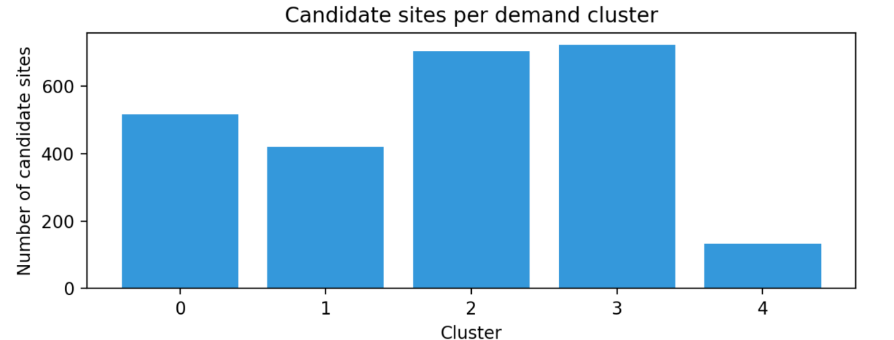

# 🔌 EV Charging Station Recommendation System

A data-driven decision-support tool that analyzes **population density, traffic
volume, points-of-interest, income levels, and existing charging infrastructure**
to recommend the best locations for **new EV charging stations** — visualized on
an interactive map and controllable through a Streamlit dashboard.

⭐⭐⭐⭐⭐ | `Python` `Pandas` `Scikit-learn` `Folium` `Streamlit`

---

## 1. Problem Statement

Electric vehicle adoption is growing far faster than charging infrastructure
planning processes can keep up with. In most cities today, charging stations
are sited **reactively** — wherever land/permits are easiest to get — rather
than **proactively**, based on where demand actually is. This causes two
recurring failures:

- **Charging deserts**: high-population, high-traffic areas with no nearby
  charger, causing range anxiety and poor EV adoption in those areas.
- **Oversaturation**: multiple stations clustered in the same convenient
  spot (e.g., one mall) while a few kilometers away demand goes unserved,
  wasting capital and land.

**Goal:** given data about a city (population, traffic, commercial activity,
income, and existing stations), systematically **score every possible
location** for how well it would serve unmet EV-charging demand, and then
**select a spatially well-distributed shortlist** of the best new sites.

---

## 2. Solution Approach

The system is a 4-stage pipeline:

```
 Raw city data          Feature engineering        ML scoring              Spatial selection
┌───────────────┐      ┌────────────────────┐    ┌─────────────────┐    ┌───────────────────────┐
│ Population     │      │ Distance to nearest │    │ Random Forest    │    │ Greedy max-coverage   │
│ Traffic        │ ───▶ │ existing station    │───▶│ Regressor scores │───▶│ selection with        │
│ POI/commercial │      │ Distance to center  │    │ every candidate  │    │ min-distance spacing  │
│ Income         │      │ Normalized features  │    │ site 0–100       │    │ → final shortlist     │
│ Existing chargers    │                      │    │ + KMeans demand  │    │                       │
└───────────────┘      └────────────────────┘    │ clustering       │    └───────────────────────┘
                                                    └─────────────────┘
```

1. **Data ingestion** — a grid of candidate sites is laid over the city, each
   carrying population density, traffic volume, POI/commercial density,
   income index, and geographic coordinates. (See [Data note](#5-about-the-data) below.)
2. **Feature engineering** — for every candidate site we compute:
   - `dist_to_nearest_station_km` — haversine distance to the closest existing charger
   - `dist_to_city_center_km` — proxy for build/operate cost & accessibility
3. **ML scoring**:
   - A **Random Forest Regressor** predicts a 0–100 "suitability score" per site.
   - A **KMeans** model clusters sites into demand regimes (e.g. dense downtown
     vs. suburban vs. highway/commercial corridor) for interpretability.
4. **Spatial recommendation** — candidates too close to an existing station are
   filtered out, then a **greedy spatial selection algorithm** picks the top-N
   highest-scoring sites subject to a minimum-distance constraint between
   recommendations, so the output is spread across the city instead of
   clumped in one neighborhood.
5. **Visualization** — an interactive **Folium** map (demand heatmap + existing
   vs. recommended stations) embedded in a **Streamlit** dashboard where
   planners can tune weights and constraints live.

---

## 3. Algorithms Used

| Stage                | Algorithm                                          | Why this algorithm                                                                                                                                                                                                                                                                                                             |
| -------------------- | -------------------------------------------------- | ------------------------------------------------------------------------------------------------------------------------------------------------------------------------------------------------------------------------------------------------------------------------------------------------------------------------------ |
| Site scoring         | **Random Forest Regressor** (`sklearn.ensemble`)   | Captures nonlinear interactions between demand features without manual feature-crossing; robust to mixed/unscaled inputs; gives free, interpretable feature importances — important for planners who need to justify a recommendation; trains in milliseconds so the dashboard stays interactive.                              |
| Demand segmentation  | **KMeans Clustering** (`sklearn.cluster`)          | Unsupervised — needs no labeled outcome data. Groups sites into a handful of natural "demand regimes," useful even before any station has ever been built in the city.                                                                                                                                                         |
| Feature scaling      | **StandardScaler**                                 | Puts population/traffic/POI/income on comparable scales before clustering (KMeans is distance-based and sensitive to feature scale).                                                                                                                                                                                           |
| Distance computation | **Haversine formula**                              | Accurate great-circle distance between lat/lon points on Earth's surface — used for "distance to nearest station" features and for spatial deduplication.                                                                                                                                                                      |
| Final site selection | **Greedy max-coverage / p-median–style heuristic** | Selecting the _provably optimal_ spatially-spread set of N sites is an NP-hard facility-location problem. The greedy heuristic (sort by score, accept if far enough from prior picks) is a well-established fast approximation that gives good, explainable, real-time results — appropriate for an interactive planning tool. |

**Model validation:** the Random Forest is evaluated with an 80/20 train/test
split, reporting **R²** and **MAE** on held-out data (shown live in the
dashboard's "Model Insights" tab). On the bundled synthetic dataset it
typically reaches **R² ≈ 0.85–0.90**.

---

## 4. Project Structure

```
ev_charging_recommender/
├── app.py                     # Streamlit dashboard (main entry point)
├── run_pipeline.py            # CLI runner (no UI) — good for scripting/automation
├── requirements.txt
├── data/
│   └── generate_data.py       # Synthetic city data generator (swap for real data)
├── src/
│   ├── utils.py                # Haversine distance helpers
│   ├── data_processing.py      # Feature engineering + synthetic training label
│   ├── model.py                # RandomForestRegressor + KMeans wrappers
│   ├── recommender.py          # Greedy spatial selection logic
│   ├── mapping.py              # Folium map builder
│   └── pipeline.py             # Wires all stages together (used by both app.py and CLI)
└── outputs/                    # CSV + HTML map written here by run_pipeline.py
```

---

## 5. About the Data

This project ships with a **synthetic but realistic data generator**
(`data/generate_data.py`) so it runs fully offline, reproducibly, with **no
API keys or downloads required**. It builds population/traffic/POI surfaces
from randomized Gaussian "hotspots" the way real cities cluster around
downtown cores, tech parks, and transit hubs, and places existing stations
preferentially near high-POI areas (mirroring real-world deployment
patterns).

**To use real data**, replace `generate_city_data()` with loaders for:

- Population: census / municipal ward data
- Traffic: government traffic-department counts, or a proxy like Google
  Popular Times / OSM road-density
- POI/commercial density: OpenStreetMap Overpass API, Google Places
- Existing stations: [OpenChargeMap API](https://openchargemap.org/) or your
  utility's public station registry

Because every downstream module only depends on column names
(`latitude`, `longitude`, `population_density`, `traffic_volume`,
`poi_score`, `income_index` for candidates; `latitude`, `longitude` for
stations), swapping in real data requires **no changes** to
`data_processing.py`, `model.py`, `recommender.py`, or `mapping.py`.

---

## 6. How to Run

### Setup

```bash
# 1. Extract the project and move into it
cd ev_charging_recommender

# 2. (Recommended) create a virtual environment
python3 -m venv venv
source venv/bin/activate        # Windows: venv\Scripts\activate

# 3. Install dependencies
pip install -r requirements.txt
```

### Option A — Interactive dashboard (recommended)

```bash
streamlit run app.py
```

Then open the URL Streamlit prints (usually `http://localhost:8501`).
Use the sidebar to pick a city, tune scoring weights, spatial constraints,
and the number of stations to recommend, then click **"Generate
Recommendations."**

### Option B — Command line (no UI)

```bash
python run_pipeline.py --city Bengaluru --n_new_sites 10
```

Available flags:

```
--city {Bengaluru,Delhi,Mumbai}
--grid_size INT                 # candidate grid resolution (default 45)
--n_existing_stations INT       # simulated existing stations (default 25)
--n_new_sites INT                # how many new sites to recommend (default 10)
--min_dist_existing_km FLOAT    # exclude sites closer than this to an existing station (default 1.2)
--min_dist_between_new_km FLOAT # min spacing enforced between recommendations (default 1.5)
--out_dir PATH                  # where to write outputs (default "outputs")
```

This writes:

- `outputs/candidate_sites_scored.csv` — every candidate with its predicted score
- `outputs/recommended_stations.csv` — the final shortlist
- `outputs/recommendation_map.html` — open this directly in a browser

---

## 7. Advantages

- **Data-driven, not guesswork** — replaces ad-hoc site selection with a
  transparent, reproducible scoring model.
- **Explainable** — Random Forest feature importances + KMeans cluster
  profiles let planners see _why_ a site was recommended, not just a black-box
  ranking.
- **Spatially aware** — the greedy min-distance constraint avoids the common
  failure mode of naive top-N ranking (everything clustering in one
  neighborhood).
- **Interactive & fast** — Streamlit + a lightweight Random Forest means
  planners can adjust priorities (e.g. "weight traffic more than income")
  and see updated recommendations in seconds, no re-coding required.
- **Modular & data-source agnostic** — swapping synthetic data for real
  census/traffic/POI feeds requires no changes to the modeling or
  recommendation code.
- **Visual, stakeholder-friendly output** — an interactive map communicates
  results far better than a spreadsheet of coordinates to non-technical
  stakeholders (city planners, utility executives).

## 8. Disadvantages / Limitations

- **Bundled data is synthetic** — out of the box, scores reflect a simulated
  city, not ground truth. Real deployment requires wiring in actual census,
  traffic, and POI datasets (see [§5](#5-about-the-data)).
- **No temporal dynamics** — the model treats demand as static; it doesn't
  account for time-of-day charging patterns, seasonal tourism spikes, or
  future population growth/EV-adoption forecasts.
- **No grid/electrical-capacity constraints** — a recommended site might be
  electrically infeasible (transformer capacity, grid connection cost) —
  this system optimizes _demand fit_, not _engineering feasibility_; it
  should be a first-pass shortlist, not a final decision.
- **No cost/land-availability modeling** — doesn't account for real-estate
  cost, zoning restrictions, or land ownership/availability.
- **Greedy selection is an approximation** — it is not guaranteed to find
  the mathematically optimal spatial arrangement (that's NP-hard); it
  trades optimality for speed and explainability.
- **Synthetic training label** — the demo's "ground truth" suitability score
  is a hand-built formula, not observed real-world outcomes (e.g. actual
  utilization of built stations). In production, this should be replaced
  with real outcome data as it becomes available.
- **Grid-based candidate search** — a fixed lat/lon grid may miss the
  single best pinpoint location within a cell (e.g. "this exact mall
  parking lot" vs. "somewhere near this mall"); resolution can be increased
  but at a compute cost.

---

## 9. Possible Extensions

- Swap in real datasets (OpenChargeMap, OSM Overpass, census/traffic APIs).
- Add EV-registration growth forecasts as a feature (time-series model).
- Add a cost layer (land price, grid-connection distance) and turn site
  selection into a proper multi-objective optimization (e.g. with
  `PuLP`/`OR-Tools` for a real facility-location / p-median solve).
- Add a "coverage simulation" — for a proposed set of stations, compute
  what % of population is within X minutes of a charger.
- Swap Random Forest for Gradient Boosting (XGBoost/LightGBM) or a
  Gaussian Process for uncertainty-aware scoring, and A/B compare.

---

## 10. Tech Stack Summary

| Layer                   | Tool                                                         |
| ----------------------- | ------------------------------------------------------------ |
| Data handling           | Pandas, NumPy                                                |
| Machine learning        | Scikit-learn (RandomForestRegressor, KMeans, StandardScaler) |
| Geospatial              | Custom haversine implementation                              |
| Mapping / visualization | Folium (+ HeatMap plugin), Matplotlib                        |
| Dashboard / UI          | Streamlit, streamlit-folium                                  |

---

## 11. Sample Outputs

The pipeline generates a set of visual outputs that highlight the recommended
charging-station locations and the underlying map-based analysis.

### Screenshots

<p align="center">
  
  
  
</p>

### Demo Video

<video controls width="100%" poster="img1.png">
  <source src="demo.mp4" type="video/mp4">
  Your browser does not support the video tag.
</video>

## License

Provided as-is for educational and portfolio purposes. Swap in real data
sources before using for actual municipal or utility planning decisions.
